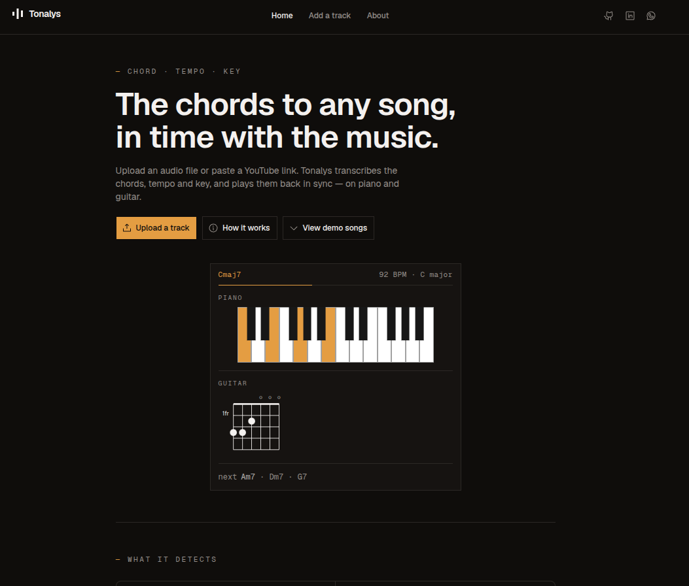
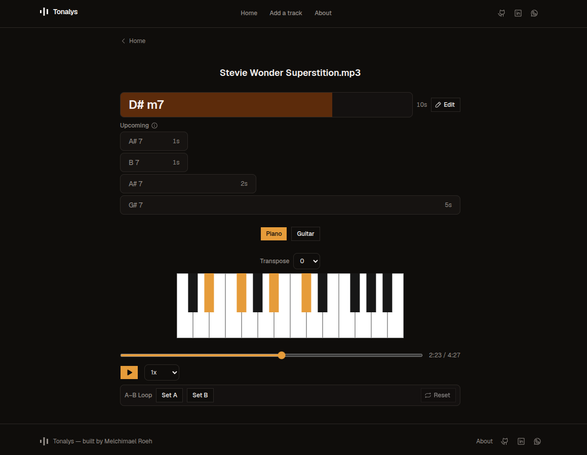
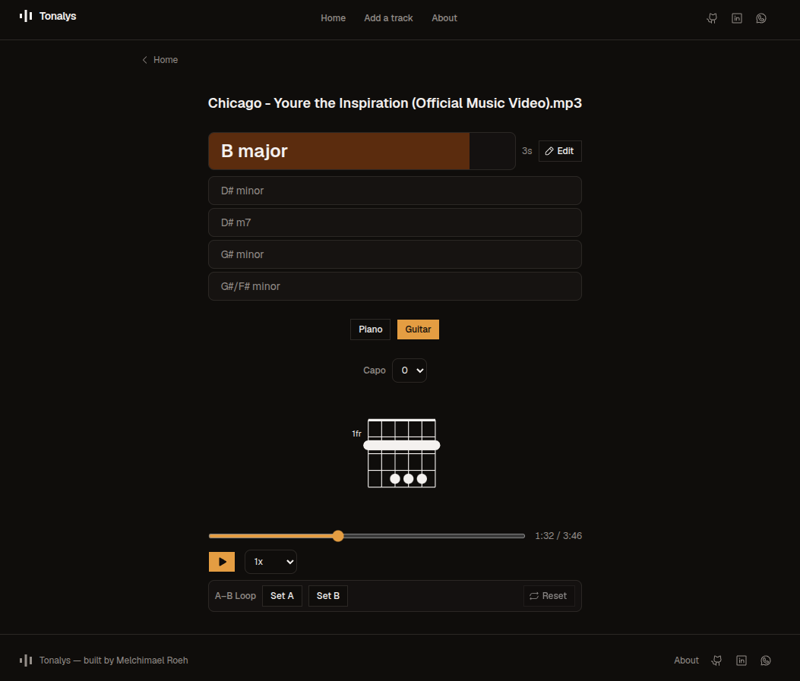
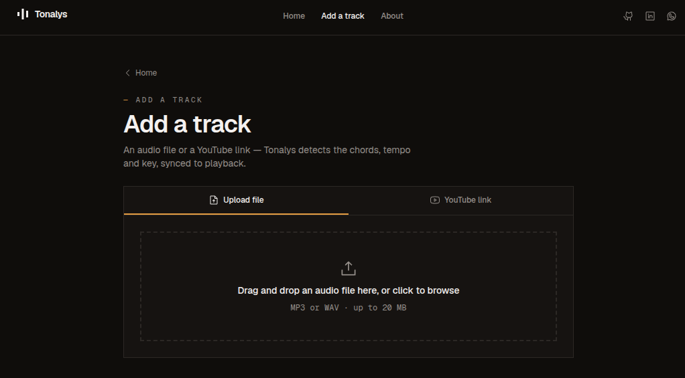
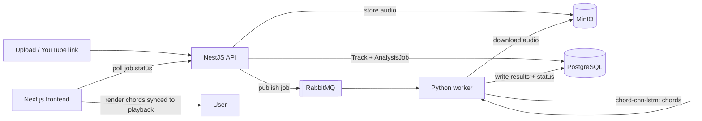

# Tonalys

**The chords to any song, in time with the music.**

Upload an audio file or paste a YouTube link. Tonalys transcribes the
**chords**, **tempo** and **key**, and plays them back **synced to the audio** —
on a piano keyboard and as guitar chord shapes.



**Live demo:** https://tonalys.melchimael.dev

> This is a demo running on a modest, CPU-only server (no GPU) — the AI model
> is much slower than it would be on real hardware. Analysis can take several
> minutes. Thanks for your patience!

> Personal project, single maintainer. It's a **V1** — the analysis pipeline
> and the player are done; more is planned (see [Roadmap](#status--roadmap)).

---

## What it does

- **Chord transcription** — not just major/minor: maj7, sus2 / sus4, dim, aug,
  6ths, 7ths, 9ths and **slash chords** (chord over a bass note).
- **Tempo** (BPM) and **key** detection, read straight off the audio.
- **Synced playback** — the current chord and the next few scroll in time with
  the track; a progress bar fills across each chord.
- **Two views** — a highlighted **piano keyboard** or fingered **guitar chord
  diagrams** (from the `chords-db` shape database).
- **Practice tools** — **capo** (0–7) and **transpose** (±6), both *visual only*
  (they never touch the audio), an **A–B loop**, **0.5×–2× speed**
  (pitch-preserved), and **manual chord correction** when the model gets one
  wrong.
- **Two inputs** — drag-and-drop an MP3/WAV, or paste a YouTube URL.

| Player — piano | Player — guitar |
|---|---|
|  |  |



---

## How it works

Tonalys is **AI-powered**: the chords, tempo and key come from trained
audio models, not hand-written DSP heuristics.

- **Chords** — [chord-cnn-lstm](https://github.com/music-x-lab/ISMIR2019-Large-Vocabulary-Chord-Recognition)
  (ISMIR 2019, "Large-Vocabulary Chord Transcription"): a CNN + Bi-LSTM +
  CRF/HMM model over CQT features that recognises a large chord vocabulary
  (triads, 7ths, extensions, inversions), vendored under
  `apps/worker/vendor/chord_cnn_lstm/`.
- **Tempo & key** — [madmom](https://github.com/CPJKU/madmom): a DBN-backed RNN
  beat tracker for tempo and a CNN key classifier.

Everything runs **on CPU** — no GPU required.

### Pipeline



An upload or a YouTube link creates a `Track` and an `AnalysisJob` (status
`PENDING`). The job is published to RabbitMQ; the worker takes **one job at a
time**, downloads the audio, runs tempo → key → chord detection, writes the
results and flips the status to `READY`. The frontend polls the job and then
opens the player.

### Stack

| Part | Tech |
|---|---|
| Frontend | Next.js (App Router), TypeScript, Tailwind, shadcn/ui, TanStack Query |
| API / orchestration | NestJS, Prisma, PostgreSQL, `@nestjs/schedule` |
| Analysis worker | Python, FastAPI, madmom, chord-cnn-lstm, yt-dlp |
| Messaging | RabbitMQ (Nest ↔ worker) |
| Object storage | MinIO (S3-compatible) |
| Infra | Docker Compose · pnpm workspaces + Turborepo monorepo |

Monorepo layout: `apps/next`, `apps/nest`, `apps/worker`,
`packages/shared-types` (shared Zod DTOs).

### Public-instance guardrails

The hosted instance is small (one CPU VPS). To keep it usable when open to
the public:

- a per-day cap on new analyses (app-wide),
- the worker analyses **one track at a time**; others wait in the queue,
- closing the tab mid-analysis **cancels** the job (audio + row removed),
- uploaded audio for one-shot analyses is **auto-deleted after 24h** (a daily
  cron); a curated set of demo songs is kept.

---

## Status & roadmap

**V1 (now):** file/YouTube input, chord + tempo + key detection, synced
piano/guitar playback, capo/transpose, A–B loop, speed, manual chord editing.

**Planned:**

- **Functional harmony** — scale degrees / roman numerals per chord, and an
  explicit key/scale timeline (keys can change within a song).
- **More views** — a beat / bar grid (chords laid out in measures, lead-sheet
  style) alongside the current scrolling list.
- **Learn mode** — practice-oriented view (drills, looped sections, chord
  quizzes).
- Deeper key handling, more input sources, quality-of-life polish.

Not planned: multi-user accounts, i18n (the product is English-only).

---

## Running it locally

### Prerequisites

- **Node 24** (pinned in `.nvmrc`; [fnm](https://github.com/Schniz/fnm) or nvm)
- **pnpm** (`corepack enable`)
- **Docker** + Docker Compose
- For the worker natively: **Python 3.12**, plus `ffmpeg` and `git` on `PATH`

### Quick start (full stack in Docker)

```bash
cp .env.example .env          # then edit the secrets
docker compose up -d --build  # next :3000 · nest :3001 · worker · postgres · rabbitmq · minio
```

Open http://localhost:3000.

> Any literal `$` in a `.env` value (e.g. a bcrypt hash) must be escaped as
> `$$` — Docker Compose interpolates `$xxx` inside `.env` values.

### Dev workflow (hot reload)

Run the infra in Docker and the three apps natively:

```bash
./scripts/dev-up.sh --seed              # postgres + rabbitmq + minio, migrations, seed

pnpm --filter next dev                  # :3000
PORT=3001 pnpm --filter nest start:dev  # :3001

cd apps/worker && python3 -m venv .venv && source .venv/bin/activate
pip install --index-url https://download.pytorch.org/whl/cpu torch
pip install -r requirements.txt
uvicorn app.main:app --reload --port 8000
```

`apps/next` needs its own `apps/next/.env.local` with
`NEST_API_URL=http://localhost:3001`.

### Checks

```bash
pnpm exec turbo run lint typecheck test          # whole monorepo
pnpm --filter nest run test:e2e                   # integration (needs infra up)
cd apps/worker && python -m pytest tests/ -v      # worker
```

CI runs lint → typecheck → unit tests on every PR. On `main` the same
checks run, then the app builds and deploys itself.

### Maintenance

```bash
pnpm --filter nest run cleanup   # delete one-shot tracks older than the retention window (DB + MinIO)
```

---

## Deployment

Every merge to `main` builds three Docker images, pushes them to GHCR and
redeploys the stack on a single VPS. TLS and hostname routing are handled by
a separate reverse proxy on the host; this stack just joins an external
`edge` Docker network.

---

## Privacy & usage

Tonalys collects as little as possible:

- **Stored:** the uploaded audio (deleted automatically after ~24h, unless it's
  a demo song), the YouTube URL, and the analysis results (chords / tempo /
  key). Standard web-server logs may include IP addresses.
- **Not stored / not done:** no accounts, no email, no analytics or tracking,
  nothing sold or shared.
- **Your responsibility:** only analyse audio you have the right to use.
  YouTube extraction is provided for **personal use only**.
- Takedown / questions: open a GitHub issue or use the contact links below.

There is no separate "Privacy Policy" or "Terms of Service" page — this
section is it, for a non-commercial single-maintainer project.

---

## License & third-party

**Tonalys source code — [MIT](LICENSE)** © 2026 Melchimael Roeh.

The models it runs on have their own terms:

| Component | License | Note |
|---|---|---|
| Tonalys code | MIT | this repo |
| chord-cnn-lstm (vendored) | MIT © 2023 Music X Lab | `apps/worker/vendor/chord_cnn_lstm/` |
| madmom (code) | BSD-style | |
| **madmom pretrained weights** | **CC BY-NC-SA 4.0** | **NonCommercial** |

Because Tonalys ships madmom's pretrained beat/key weights, **running it as-is
is non-commercial only**. Commercial use would require replacing madmom's
models with commercially-licensed equivalents. Tonalys itself is personal and
unmonetised.

`@tombatossals/chords-db` (guitar chord shapes) — MIT.

---

## Author

Built by **Melchimael Roeh**.

- GitHub — https://github.com/melchimaelran/tonalys
- LinkedIn — https://www.linkedin.com/in/melchimael-roeh-429ab6210/
- WhatsApp — https://wa.me/261387817393
